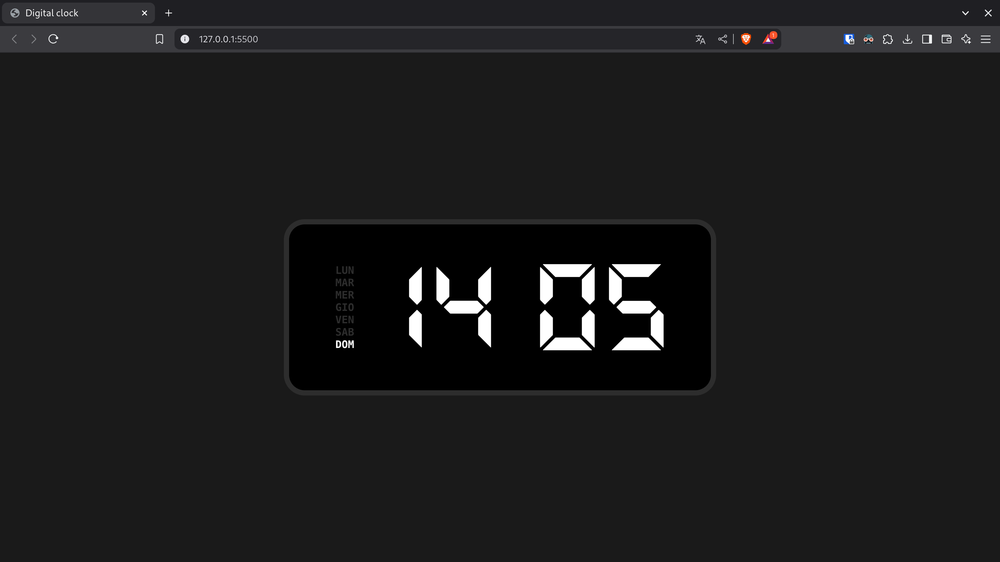

# 🕰️ Digital Clock

A minimalist digital clock web application featuring a sleek LED display with day of the week indicators.

## 🖼️ Preview



## 🌐 Live Demo

Try it now: [Digital Clock](https://mcarrarodev.github.io/Digital-Clock/)

## ✨ Features

- ⏰ Real-time digital clock display
- 💡 LED-style numbers
- 📅 Day of the week indicator
- ⚡ Blinking colon separator
- 🌙 Dark theme interface
- 📱 Responsive design

## 🛠️ Technologies


## 📁 Structure

```
.
├── index.html         # Main HTML structure
├── style/
│   ├── css/
│   │   └── style.css # Styling and animations
│   └── fonts/        # Custom fonts (FX-LED and Hack)
└── js/
    └── script.js     # Clock functionality
```

## 🚀 Getting Started

1. Clone this repository
   ```bash
   git clone https://github.com/MCarraroDev/digital-clock.git
   ```
2. Open `index.html` in your web browser
3. Enjoy your new digital clock!

## 👨‍💻 Credits

Developed by [MCarraroDev](https://github.com/MCarraroDev)

## 📄 License

This project is licensed under the MIT License - see the [LICENSE](LICENSE) file for details.

---

<p align="center">
  Made by Marco Carraro 🌟
</p>
